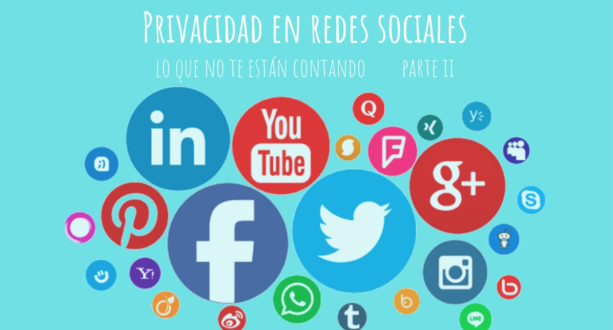

## Privacidad en redes sociales: Lo que no te están contando.

Documentación utilizada para la realización de las presentaciones sobre Privacidad en redes sociales e Internet realizadas por Laura Sánchez de Rojas y María Soledad Espinosa. 

### Contenido: 
- Privacidad en redes sociales lo que no te están contando.pdf
- Entrada_Blog_Parte_I.pdf disponible en: http://138.68.77.51/2019/01/03/privacidad-en-las-redes-sociales-lo-que-no-te-estan-contando-parte-i/ 
- Entrada_Blog_Parte_II.pdf disponible en: http://138.68.77.51/2019/01/03/privacidad-en-redes-sociales-lo-que-no-te-estan-contando-parte-ii/
- Vídeo realizado para parte I disponible en: https://www.youtube.com/watch?v=9lFP1qa5uic
- Vídeo realizado para parte II disponible en: https://www.youtube.com/watch?v=XnUm4-EqZnI